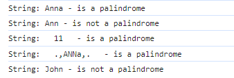
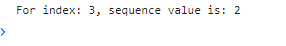

**Результат работы всех программ - в логах консоли файла "HTML документ.html"**  

1) **В чем разница между null и undefined?**  
   
   -Оба типа данных выражают отсутствие какого-либо значения. Тип null используется тогда, когда нужно явно указать отсутствие чего-либо. Тип undefined, в свою очередь, выражает пустоту, которую явно/намеренно никто не задавал. Общая идея undefined заключается в том, что с помощью него сам язык JS выражает пустоту. С помощью null пустоту выражает разработчик. Другими словами, undefined - это значение по умолчанию, если явно ничего не было прописано в коде. В этом и заключается ключевое отличие undefined от null 

   -Пример с чайником и розеткой: 

     let socket = null; // Изначально есть розетка и в нее ничего не подключено 

     socket = "Чайник"; // Я подключаю чайник в розетку 

     socket = null; // Я отключаю чайник от розетки и опять в розетку ничего не подключено 

     Здесь явно был использован null, чтобы показать, что в розетку ничего не подключено. А undefined - это ситуация, когда невозможно что-то определить, так как самой розетки нет и никогда не было 

   -Ничего не мешает использовать undefined вместо null и в целом, программа будет корректно работать. Но все-таки так делать не стоит. Они имеют разные назначения и не стоит этим пренебрегать. Тут можно привести следующую аналогию: нужно забить гвоздь в доску. У меня под рукой лежат молоток и кокос. Я могу забить гвоздь, используя кокос. Но я так делать не буду - разумеется, я буду использовать молоток.

2) **Данное логирование будет выводить ошибку:**  
   
   const obj = {}; 
   console.log(obj.someprop.x); 

   -Ошибка возникает, так как у объекта obj не определено поле someprop, и мы пытаемся получить у "не определено" значение поля x. То есть здесь происходит попытка у obj обратиться к значению, которое отсутствует. Как можно помнить - JS такое значение обозначает как undefined. Также undefined - не является объектом. У него нет никаких полей, в том числе нет поля x. 

3) **Способы проверки в JS того, что значение - это массив:**  
 
   a. Вызвать у встроенного объекта Array - функцию isArray (в нее передаем проверяемое значение); 

   b. Использовать бинарный оператор instanceof, где два операнда - это само значение и встроенный объект Array. Также можно использовать проверку с помощью constructor.name на значение 'Array'; 

   c. Использовать проверку с помощью Object.prototype.toString.call() - нужно перадать проверяемое значение. 

4) **Проверка, что целое число является квадратом, не используя математические функции:**  
 
   **Я напишу несколько вариантов в зависимости от того, что имеется в виду под математическими функциями. Во всех вариантах - я не использую функции из встроенного объекта Math, так как считаю, что они точно попадают под критерий - математические функции.** 

   **-Первый вариант - оператор \*\*: использование оператора \*\* не считается как использование математических функций:** 

   **-Файл isSquare.option.first.js from ./js/fourthTask/isSquare.option.first.js** 

   ```
   const digit1 = 25;
   const digit2 = 26;

   try {
    isSquare(digit1);
    isSquare(digit2);
   }
   catch (err) {
    console.log(err);
   }

   function isSquare(digit) {
    if (typeof digit !== 'number') {
      throw new Error(`Value ${digit} is not a number`);
    }

    if (isSquareConfirm(digit)) {
      console.log(`Число ${digit} является квадратом`);
    }
    else {
      console.log(`Число ${digit} не является квадратом`);
    }
   }

   function isSquareConfirm(digit) {
    if (digit < 0 || digit % 1 !== 0) {
      return false;
    }

    if ((digit ** (1 / 2)) % 1 === 0) {
      return true;
    }

    return false;
   }
   ``` 

   -Вывод: 
    
   ")   
     

   **-Второй вариант - реализация метода Ньютона для x^(2) - n = 0: использование оператора ** считается как использование математических функций (все-таки операторы, так скажем, "под копотом" - это такие же функции):** 

   **-Файл isSquare.option.second.js from ./js/fourthTask/isSquare.option.second.js** 
      
   ```
   const digit1 = 25;
   const digit2 = 26;

   try {
    isSquare(digit1);
    isSquare(digit2);
   }
   catch (err) {
    console.log(err);
   }

   function sqrt(digit) {
    let x = digit;
    let y = (x + 1) / 2;

    while (y < x) {
      x = y;
      y = (x + digit / x) / 2;
    }

    return x;
   }
   
   function isSquare(digit) {
    if (typeof digit !== 'number' || digit < 0 || digit % 1 !== 0) {
      throw new Error(`Value ${digit} must be a positive integer`);
    }

    const root = sqrt(digit);
    if (root % 1 === 0 && root * root === digit) {
      console.log(`Число ${digit} является квадратом`);
    }
    else {
      console.log(`Число ${digit} не является квадратом`);
    }
   }
   ``` 

   -Вывод: 
     
   ") 
    

   **-Третий вариант - бинарный поиск: прошлые два варианта не подходят:** 

   **-Файл isSquare.option.third.js from ./js/fourthTask/isSquare.option.third.js** 
    
   ```
   const digit1 = 9;
   const digit2 = 15;

   try {
    isSquare(digit1);
    isSquare(digit2);
   }
   catch (err) {
    console.log(err);
   }
   
   function squareRootBinarySearch(digit) {
    let start = 0;
    let end = digit;

    while (start <= end) {
      let mid = (start + end) / 2;
      let remainder = mid % 1;

      if (remainder > 0) {
        mid = (start + end) / 2 - remainder;
      }

      if (mid * mid === digit) {
        return mid;
      }
      else if (mid * mid > digit) {
        end = mid - 1;
      }
      else if (mid * mid < digit) {
        start = mid + 1;
      }
    }

    return false;
   }

   function isSquare(digit) {
    if (typeof digit !== 'number' || digit < 0 || digit % 1 !== 0) {
      throw new Error(`Value ${digit} must be a positive integer`);
    }

    if (squareRootBinarySearch(digit)) {
      console.log(`Число ${digit} является квадратом`);
    }
    else {
      console.log(`Число ${digit} не является квадратом`);
    }
   }
   ``` 

   -Вывод: 

   ") 


5) **Напишем функцию, которая принимает в качестве аргумента строку и возвращает значение true, если строка является палиндромом, и false, если это не так. При решении задачи необходимо учитывать пробелы и знаки препинания, регистр символов в заданной строке не учитывать:**  

   **-Файл isPalindrome.js from ./js/fifthTask/isPalindrome.js** 

   ```
   const str1 = "Anna";
   const str2 = "Ann";
   const str3 = "  11  ";
   const str4 = "  .,ANNa,.  ";
   const str5 = "John";
   
   try {
    isPalindrome(str1);
    isPalindrome(str2);
    isPalindrome(str3);
    isPalindrome(str4);
    isPalindrome(str5);
   }
   catch (err) {
    console.log(err);
   }
   
   function isPalindrome(str) {
    if (typeof str !== 'string') {
      throw new Error(`${str} - is not a string`);
    }

    if (isPalindromeConfirm(str)) {
      console.log(`String: ${str} - is a palindrome`);
    }
    else {
      console.log(`String: ${str} - is not a palindrome`);
    }
   }

   function isPalindromeConfirm(str) {
    let startIndex = 0;
    let endIndex = str.length - 1;
    
    while (startIndex < endIndex) {
      if (str[startIndex].toLowerCase() !== str[endIndex].toLowerCase()) {
        return false;
      }
      
      startIndex++;
      endIndex--;
    }

    return true;
   } 
   ``` 

   -Вывод: 

    


6) **Напишем функцию, которая вернет n-ую запись в последовательности Фибоначчи, где n — это число, которое вы передаёте в качестве аргумента функции:**  

   **-Файл FibonacciSequence.js from ./js/sixthTask/FibonacciSequence.js** 
   
   ```
   class FibonacciSequence {
    constructor() {
      this.seq = [0, 1];
    }
    
    setSequence(n) {
      for (let i = 0; i < n - 1; i++) {
        this.seq.push(this.seq[i] + this.seq[i + 1]);
      }
    }

    getSequenceValue(n) {
      return this.seq[n]
    }
   }
   
   const fbSeq = new FibonacciSequence();
   fbSeq.setSequence(3);

   const seqValIndex = 3;
   const curSeqValue = fbSeq.getSequenceValue(seqValIndex);

   console.log(`For index: ${seqValIndex}, sequence value is: ${curSeqValue}`);
   ``` 

   -Вывод: 

    


7) **Рассмотрим код:** 
   

   ```
   const nums = [0, 39, 28, 34, 1, 3, 6, 8, 4, 72, 7];

   nums.forEach(num => {
    setTimeout(() => {console.log(num)}, num);
   });
   ``` 

   -Данный код выводит все значения массива nums, причем выводит не в том порядке, в котором они расположены в nums, а в другом - по возрастанию: 0, 1, 3, 4, 6, 7, 8, 28, 34, 39, 72. Так происходит из-за принципов, по которым JS работает с асинхронным кодом. Функция setTimeout в JS - является асинхронной. 

   -JS является однопоточным языком, поэтому чтобы добавить дополнительные потоки для быстрой работы кода - JS использует концепцию Event Loop - бесконечный цикл, в котором JS ожидает задачи, исполняет их и снова ожидает появления новых. То есть задачи поступают на выполнение, JS выполняет их по принципу - первый пришел, первым выполнишься, затем ожидает новые задачи. Может так случиться, что задача поступает, когда движок занят чем-то другим, тогда она ставится в очередь. 

   -В данном примере - происходит итерация по всем элементам массива nums. На каждой итерации - вызывается функция setTimeout, которая выведет в консоль элемент текущей итерации через количество миллисекунд, равное элементу текущей итерации. JS выполнит это так: 
      
    -Сначала он добавит первую функцию setTimeout в Call Stack. Но так как эта функция асинхронная, то он перенесет ее колбэк из Call Stack в Web API и удалит эту функцию из Call Stack. Web API будет ждать истечения указанного времени, а пока он ждет - JS запишет в Call Stack вторую функцию setTimeout (это произойдет сразу после того, как первая функция удалится из Call Stack) и дальше все будет то же самое. Когда Web API дождется истечения времени для какой-либо функции setTimeout - JS переместит этот колбэк в Callback Queue. Дальше когда Call Stack будет пустым, JS переместит первый колбэк из Callback Queue в Call Stack. Теперь сам колбэк выполняется и после выполнения - покидает Call Stack и JS перемещает в Call Stack первый элемент из Callback Queue. Все будет так продолжаться, пока весь js код не будет выполнен. Именно за счет этого - все элементы массива nums выводятся по возрастанию.


**JQuery - смотреть файлы HTML документ.html и main.js**
